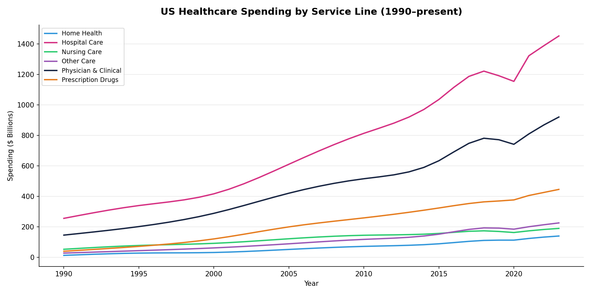
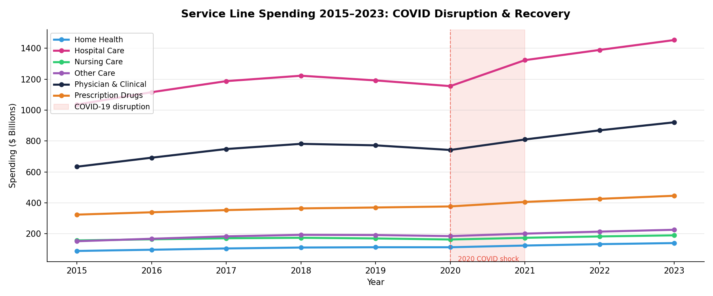
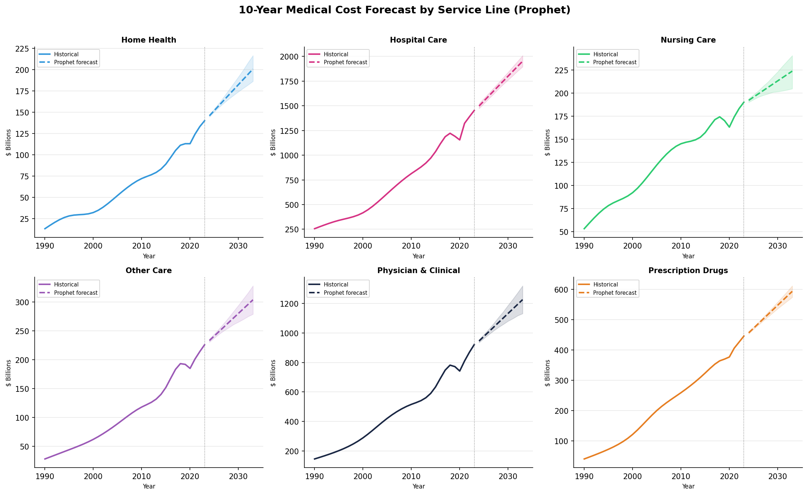
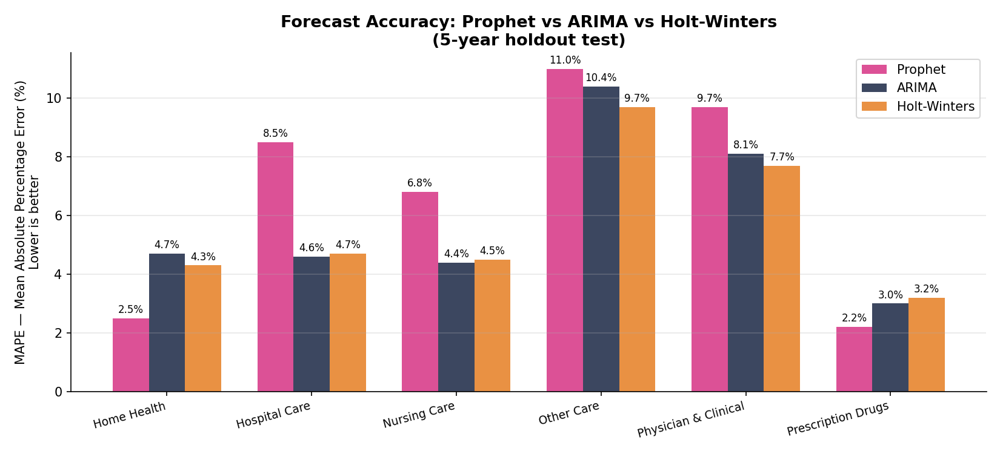
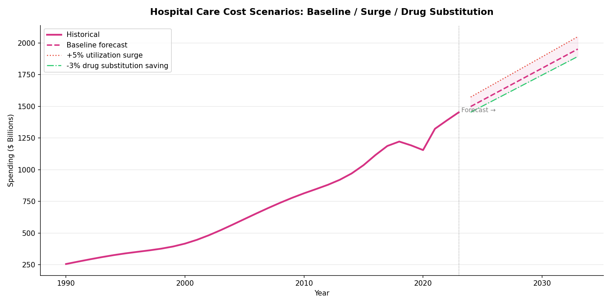

# Medical Cost Forecasting — US Healthcare Spending Analysis

Forecasting 10-year US medical cost trajectories across six CMS service lines (hospital care, physician services, prescription drugs, nursing care, home health, other), benchmarking **Prophet vs ARIMA vs Holt-Winters** on a 5-year holdout test.

## Highlights

- **No single model dominates.** Prophet wins on stable series (Home Health 2.5% MAPE, Prescription Drugs 2.2%); ARIMA wins on COVID-disrupted lines (Hospital Care 4.6%, Nursing 4.4%); Holt-Winters wins on slower-moving series (Physician & Clinical 7.7%, Other Care 9.7%). Model selection is data-dependent — the core finding of this benchmark.
- **COVID was an event shock, not structural decline.** Hospital care dropped from $1,192B (2019) to $1,155B (2020) on cancelled elective procedures, then rebounded to $1,323B in 2021 — back on trend.
- **Prescription drugs are on a structurally different growth curve**, rising from ~10% to ~31% of hospital spend since 1990, driven by specialty biologics and GLP-1 therapies.

## Data

Source: CMS National Health Expenditure (NHE) Historical Tables, 1990–2023. Real published anchor values (1990, 1995, 2000, 2005, 2010, 2015, 2019–2023) interpolated with cubic splines to build a complete annual series — see [`sql/analysis.sql`](sql/analysis.sql) for the queries run against the underlying MySQL table.

## Pipeline

`MySQL → SQL → Python (Prophet / ARIMA / Holt-Winters) → Excel Dashboard → PDF`

- [`visualise.py`](visualise.py) — model benchmarking and chart generation. Implements ARIMA(1,1,0) and Holt-Winters manually (NumPy/SciPy) and Prophet with a COVID event regressor; produces the 5 charts in [`charts/`](charts/).
- [`Medical_Cost_Forecast_Dashboard.xlsx`](Medical_Cost_Forecast_Dashboard.xlsx) — executive Excel dashboard: KPI summary, COVID impact, cumulative spend by service line, Rx growth trend, and the full MAPE benchmark table.
- [`medical_cost_forecast_executive_summary.pdf`](medical_cost_forecast_executive_summary.pdf) — one-page executive brief.
- [`data/`](data/) — query outputs (total spend by service line, YoY growth, COVID impact, Rx-to-hospital ratio, rolling averages).

## Charts

| | |
|---|---|
|  |  |
|  |  |

## Author

Akansha Singh — akansha0724@gmail.com
